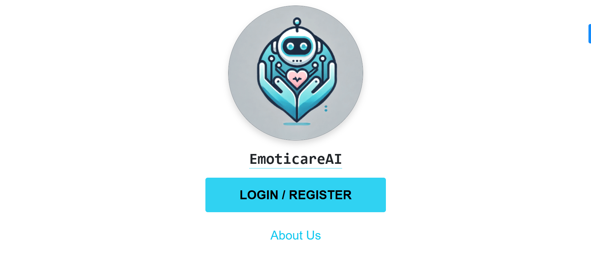
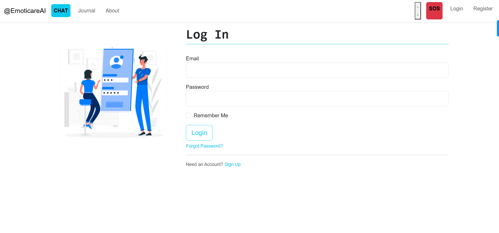
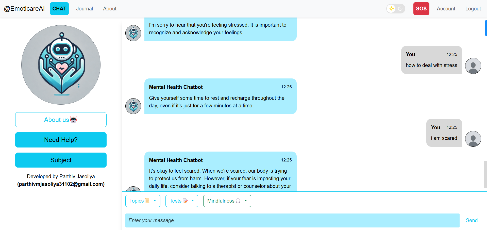
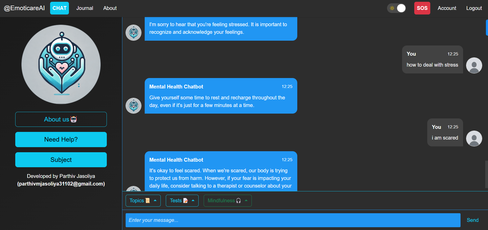
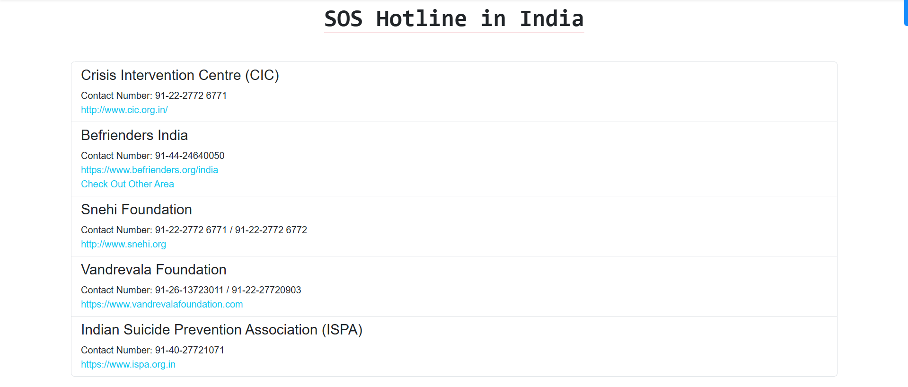
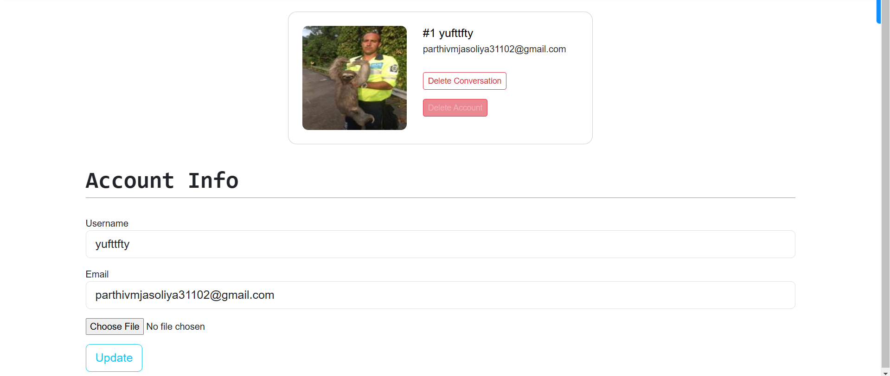
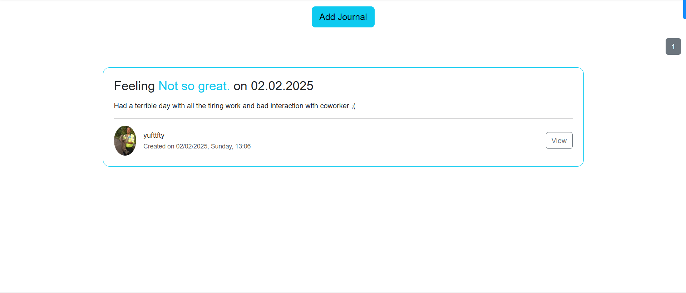

# Python-Mental-Health-Chatbot(Web-based)
### EmoticareAI Chatbot for Amdocs Hackathon Prototype Submission

AIM: This is built to educate users with the correct knowledge of mental health and also provide some functions to improve mental health ***(NOT DIAGNOSIS)***.


## Languages/Components Used

- Frontend: Python
- Backend: Python
- Database: MySQL

## Installation

```
git clone <repo-link>
```
Note: Configure your application in the `config.py` and database and make sure the database and URI are set up correctly
(for better experience use MySQL download from oracle and setup the environment)
```
pip install -r requirements.txt #U can setup venv for smoother experience
```

```
python run.py
```

## Functions
- Register, Login, and Continue as a Guest (For privacy reasons)
- Chat with the chatbot
- Select a specific topic
- Conduct a mental health test
- Mindfulness Exercises
- Journalling for manual tracking
- SOS Hotline (Only India)
- Edit profile

## Technical Domain
- Create using Python
- Flask for the Web
- SQLAlchemy for Database
- Bootstrap for the UI
- TensorFlow and NLTK for the machine learning model
- Other Library like Flask-login, Flask-bcrypt

## Screenshots













